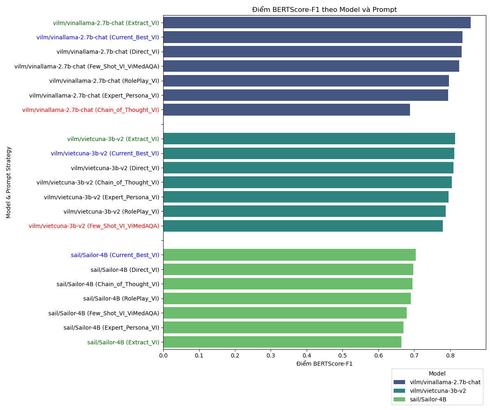
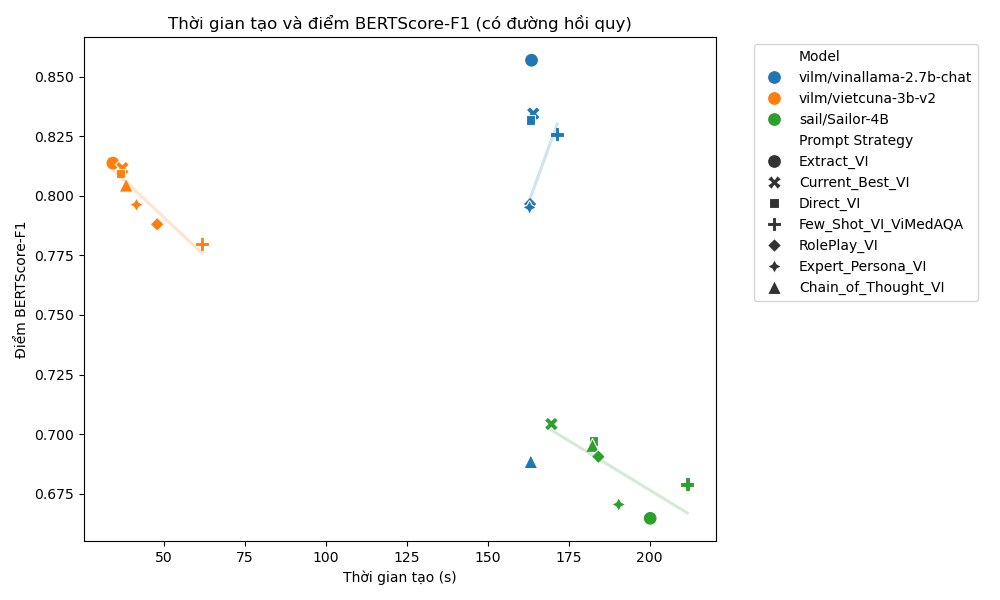
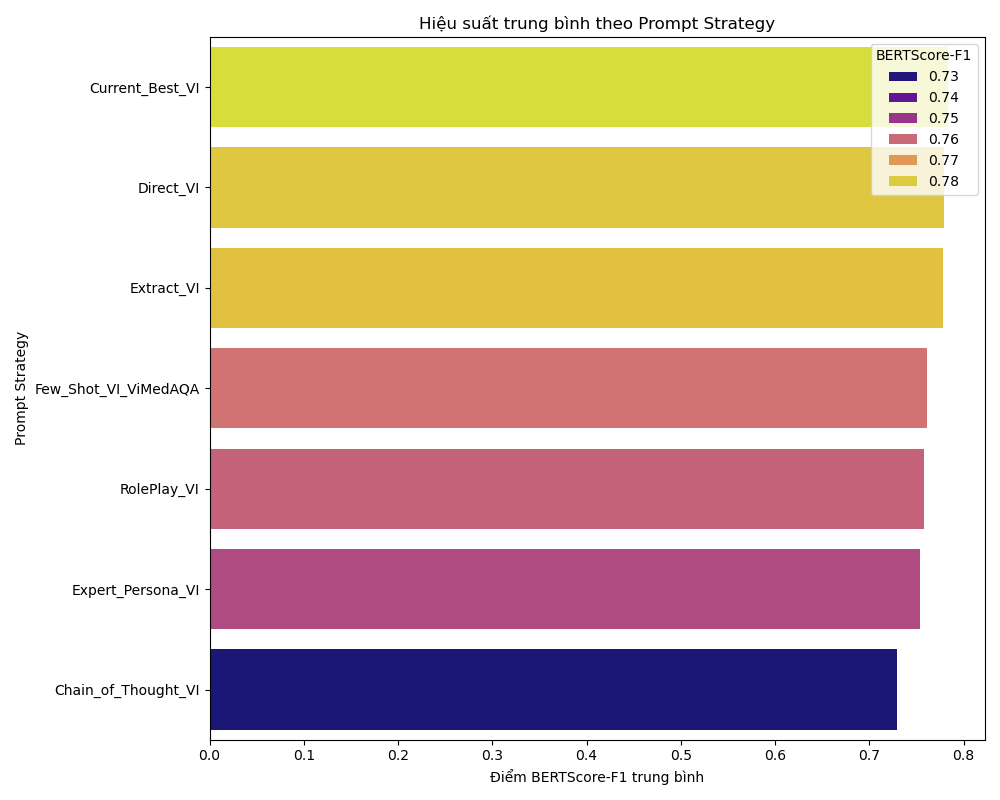

# Báo cáo hiệu suất các mô hình ngôn ngữ

## Prompt hiệu quả nhất theo từng Model (dựa trên BERTScore-F1)

|    | Model                    | Prompt Strategy   |   BERTScore-F1 |   Generation Time (s) |
|---:|:-------------------------|:------------------|---------------:|----------------------:|
|  0 | vilm/vinallama-2.7b-chat | Extract_VI        |         0.857  |                163.5  |
|  7 | vilm/vietcuna-3b-v2      | Extract_VI        |         0.8138 |                 34.33 |
| 14 | sail/Sailor-4B           | Current_Best_VI   |         0.7042 |                169.63 |

## Hiệu suất trung bình theo Prompt Strategy (Bảng)

| Prompt Strategy      |   ROUGE-L |     BLEU |   METEOR |   BERTScore-F1 |   Generation Time (s) |   Usage Count |
|:---------------------|----------:|---------:|---------:|---------------:|----------------------:|--------------:|
| Current_Best_VI      |  0.454833 | 0.1704   | 0.541733 |       0.7835   |               123.647 |             3 |
| Direct_VI            |  0.429333 | 0.160233 | 0.548433 |       0.7795   |               127.507 |             3 |
| Extract_VI           |  0.448533 | 0.2022   | 0.532467 |       0.778467 |               132.647 |             3 |
| Few_Shot_VI_ViMedAQA |  0.398033 | 0.155    | 0.5579   |       0.761533 |               148.26  |             3 |
| RolePlay_VI          |  0.3976   | 0.118033 | 0.520733 |       0.7584   |               131.73  |             3 |
| Expert_Persona_VI    |  0.3832   | 0.1364   | 0.5197   |       0.753967 |               131.647 |             3 |
| Chain_of_Thought_VI  |  0.334567 | 0.1085   | 0.4998   |       0.729367 |               128.01  |             3 |

## Biểu đồ trực quan

### Điểm BERTScore-F1 theo Model và Prompt

### Thời gian tạo và điểm BERTScore-F1 (có đường hồi quy)

### Hiệu suất trung bình theo Prompt Strategy (Biểu đồ)

