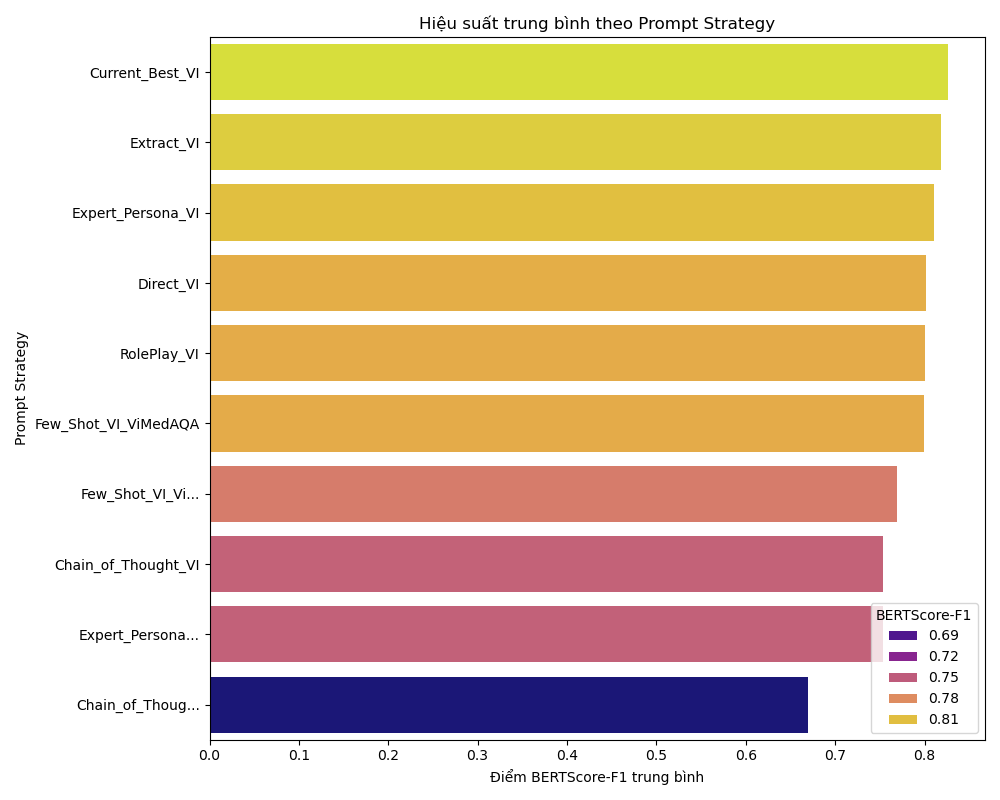

# Báo cáo hiệu suất các mô hình ngôn ngữ

## Prompt hiệu quả nhất theo từng Model (dựa trên BERTScore-F1)

|    | Model                          | Prompt Strategy   |   BERTScore-F1 |   Generation Time (s) |
|---:|:-------------------------------|:------------------|---------------:|----------------------:|
|  0 | vilm/vietcuna-3b-v2            | Extract_VI        |         0.83   |                556.98 |
|  7 | arcee-ai/Arcee-VyLinh          | Extract_VI        |         0.8551 |                754.84 |
| 14 | alpha-ai/LLAMA3-3B-Medical-COT | Current_Best_VI   |         0.8124 |                307.17 |

## Hiệu suất trung bình theo Prompt Strategy (Bảng)

| Prompt Strategy      |   ROUGE-L |     BLEU |   METEOR |   BERTScore-F1 |   Generation Time (s) |   Usage Count |
|:---------------------|----------:|---------:|---------:|---------------:|----------------------:|--------------:|
| Current_Best_VI      |  0.536333 | 0.2964   | 0.516533 |       0.826267 |               599.947 |             3 |
| Extract_VI           |  0.527367 | 0.314133 | 0.488    |       0.818233 |               525.43  |             3 |
| Expert_Persona_VI    |  0.47735  | 0.1857   | 0.5614   |       0.81045  |              1431.08  |             2 |
| Direct_VI            |  0.471967 | 0.177733 | 0.527233 |       0.801533 |              1054.85  |             3 |
| RolePlay_VI          |  0.469433 | 0.1672   | 0.524333 |       0.7999   |              1041.49  |             3 |
| Few_Shot_VI_ViMedAQA |  0.48305  | 0.1637   | 0.56365  |       0.7994   |              1523.81  |             2 |
| Few_Shot_VI_Vi...    |  0.429    | 0.1427   | 0.48     |       0.7696   |               674.26  |             1 |
| Chain_of_Thought_VI  |  0.3546   | 0.1373   | 0.47765  |       0.7539   |              2622.46  |             2 |
| Expert_Persona...    |  0.3658   | 0.0932   | 0.4206   |       0.7534   |               756.64  |             1 |
| Chain_of_Thoug...    |  0.1882   | 0.0578   | 0.3517   |       0.6698   |              1580.11  |             1 |

## Biểu đồ trực quan

### Hiệu suất trung bình theo Prompt Strategy (Biểu đồ)

