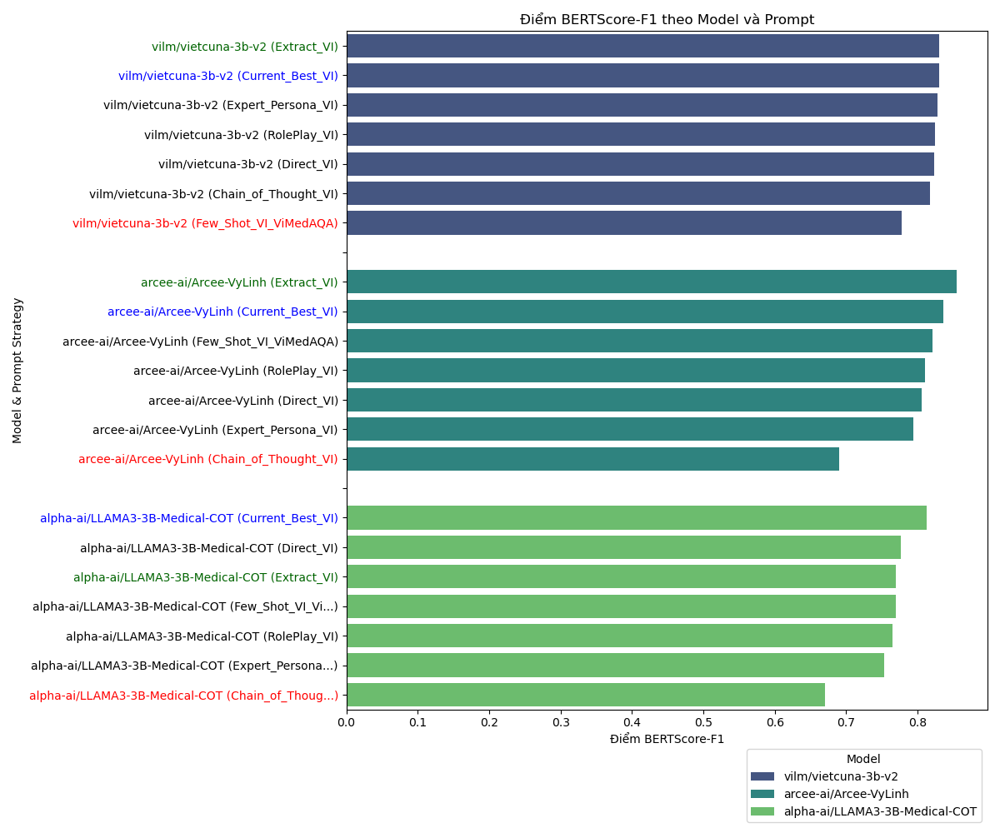
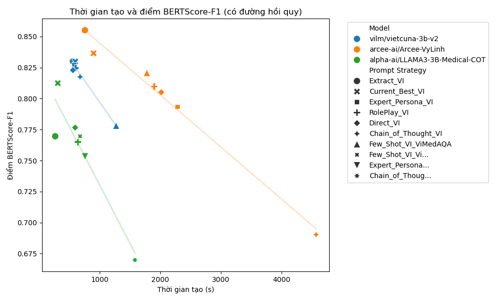

# Language Model Performance Report

## Average Performance by Model

| Model                          |   ROUGE-L |     BLEU |   METEOR |   BERTScore-F1 |   Generation Time (s) |
|:-------------------------------|----------:|---------:|---------:|---------------:|----------------------:|
| alpha-ai/LLAMA3-3B-Medical-COT |  0.390086 | 0.147314 | 0.421771 |       0.7595   |               687.016 |
| arcee-ai/Arcee-VyLinh          |  0.473357 | 0.218086 | 0.570871 |       0.801586 |              2027.6   |
| vilm/vietcuna-3b-v2            |  0.512029 | 0.2251   | 0.525357 |       0.818643 |               689.79  |

## Best Performing Prompt Strategy by Model (based on BERTScore-F1)

|     | Model                          | Prompt Strategy | BERTScore-F1 | Generation Time (s) |
| --: | :----------------------------- | :-------------- | -----------: | ------------------: |
|   9 | alpha-ai/LLAMA3-3B-Medical-COT | Current_Best_VI |       0.8124 |              307.17 |
|   0 | arcee-ai/Arcee-VyLinh          | Extract_VI      |       0.8551 |              754.84 |
|   2 | vilm/vietcuna-3b-v2            | Extract_VI      |         0.83 |              556.98 |

## Linear Regression Analysis (BERTScore-F1 vs. Generation Time)


### Model: arcee-ai/Arcee-VyLinh
```
R-squared: 0.9838
Coefficient (slope): -0.00004191
Intercept: 0.8866
Interpretation: For every 1-second increase in generation time, the BERTScore-F1 is predicted to decrease by 0.00004191.
```

### Model: vilm/vietcuna-3b-v2
```
R-squared: 0.9718
Coefficient (slope): -0.00007002
Intercept: 0.8669
Interpretation: For every 1-second increase in generation time, the BERTScore-F1 is predicted to decrease by 0.00007002.
```

### Model: alpha-ai/LLAMA3-3B-Medical-COT
```
R-squared: 0.8813
Coefficient (slope): -0.00009404
Intercept: 0.8241
Interpretation: For every 1-second increase in generation time, the BERTScore-F1 is predicted to decrease by 0.00009404.
```

## Visualizations

### BERTScore-F1 Scores by Model and Prompt Strategy


### Generation Time vs. BERTScore-F1 with Linear Regression


