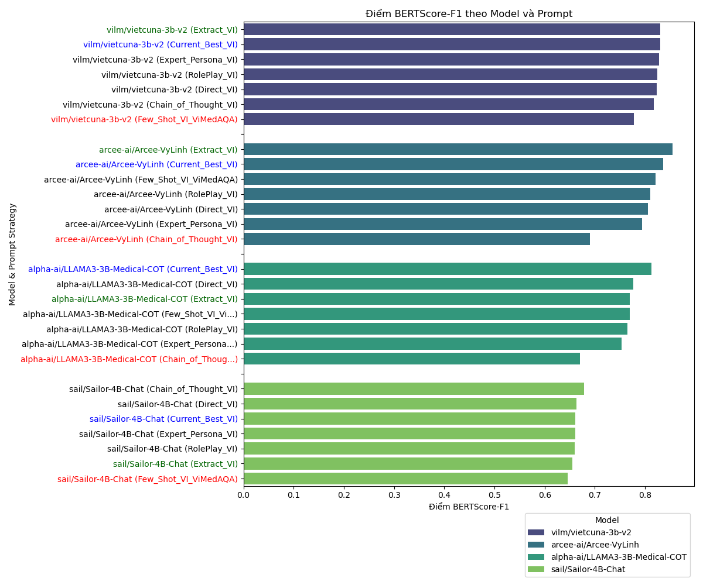
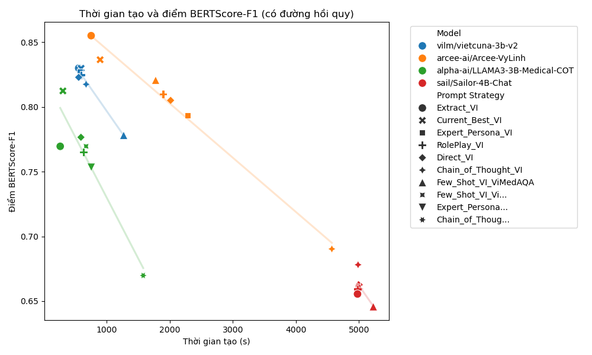
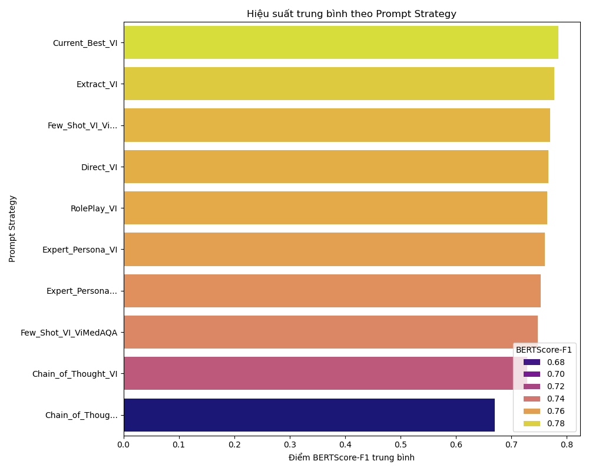

# Báo cáo hiệu suất các mô hình ngôn ngữ

## Prompt hiệu quả nhất theo từng Model (dựa trên BERTScore-F1)

|    | Model                          | Prompt Strategy     |   BERTScore-F1 |   Generation Time (s) |
|---:|:-------------------------------|:--------------------|---------------:|----------------------:|
|  0 | vilm/vietcuna-3b-v2            | Extract_VI          |         0.83   |                556.98 |
|  7 | arcee-ai/Arcee-VyLinh          | Extract_VI          |         0.8551 |                754.84 |
| 14 | alpha-ai/LLAMA3-3B-Medical-COT | Current_Best_VI     |         0.8124 |                307.17 |
| 21 | sail/Sailor-4B-Chat            | Chain_of_Thought_VI |         0.6781 |               4986.24 |

## Hiệu suất trung bình theo Prompt Strategy (Bảng)

| Prompt Strategy      |   ROUGE-L |     BLEU |   METEOR |   BERTScore-F1 |   Generation Time (s) |   Usage Count |
|:---------------------|----------:|---------:|---------:|---------------:|----------------------:|--------------:|
| Current_Best_VI      |  0.45475  | 0.24055  | 0.494425 |       0.784975 |               1700.92 |             4 |
| Extract_VI           |  0.44865  | 0.2546   | 0.476625 |       0.77755  |               1638.42 |             4 |
| Few_Shot_VI_Vi...    |  0.429    | 0.1427   | 0.48     |       0.7696   |                674.26 |             1 |
| Direct_VI            |  0.404325 | 0.150725 | 0.501475 |       0.766825 |               2039.56 |             4 |
| RolePlay_VI          |  0.402625 | 0.14255  | 0.4985   |       0.76475  |               2025.95 |             4 |
| Expert_Persona_VI    |  0.3846   | 0.145933 | 0.514    |       0.760667 |               2614.95 |             3 |
| Expert_Persona...    |  0.3658   | 0.0932   | 0.4206   |       0.7534   |                756.64 |             1 |
| Few_Shot_VI_ViMedAQA |  0.391567 | 0.132967 | 0.513233 |       0.748167 |               2758.5  |             3 |
| Chain_of_Thought_VI  |  0.298333 | 0.112133 | 0.4498   |       0.728633 |               3410.39 |             3 |
| Chain_of_Thoug...    |  0.1882   | 0.0578   | 0.3517   |       0.6698   |               1580.11 |             1 |

## Biểu đồ trực quan

### Điểm BERTScore-F1 theo Model và Prompt

### Thời gian tạo và điểm BERTScore-F1 (có đường hồi quy)

### Hiệu suất trung bình theo Prompt Strategy (Biểu đồ)

