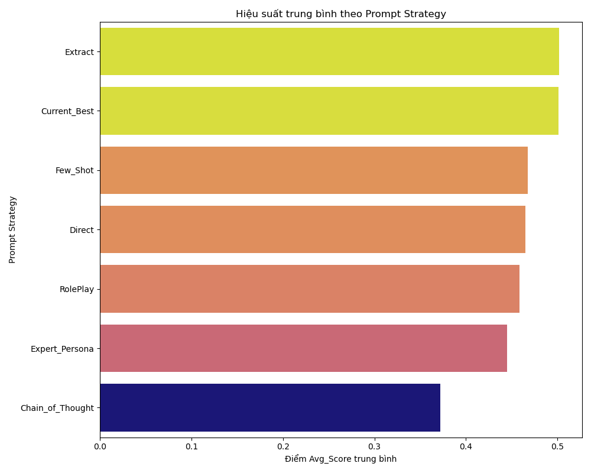

# Báo cáo hiệu suất các mô hình ngôn ngữ

## Prompt hiệu quả nhất theo từng Model (dựa trên Avg_Score)

|    | Model                 | Prompt Strategy   |   Avg_Score |   Generation Time (s) |
|---:|:----------------------|:------------------|------------:|----------------------:|
|  0 | Arcee-VyLinh          | Extract           |    0.629925 |                754.84 |
|  7 | vietcuna-3b-v2        | Extract           |    0.54175  |                556.98 |
| 14 | *vinallama-2.7b-chat  | Extract           |    0.55185  |               3868.56 |
| 21 | LLAMA3-3B-Medical-COT | Current_Best      |    0.5078   |                307.17 |
| 28 | Sailor-4B-Chat        | Extract           |    0.346625 |               4977.39 |

## Hiệu suất trung bình theo Prompt Strategy (Bảng)

| Prompt Strategy   |   ROUGE-L |    BLEU |   METEOR |   BERTScore-F1 |   Generation Time (s) |   Avg_Score |   Usage Count |
|:------------------|----------:|--------:|---------:|---------------:|----------------------:|------------:|--------------:|
| Extract           |   0.46242 | 0.26186 |  0.49676 |        0.78638 |               2084.45 |    0.501855 |             5 |
| Current_Best      |   0.46582 | 0.2396  |  0.50658 |        0.79212 |               2137.69 |    0.50103  |             5 |
| Few_Shot          |   0.42518 | 0.1558  |  0.52566 |        0.76466 |               2597.3  |    0.467825 |             5 |
| Direct            |   0.41668 | 0.15498 |  0.51542 |        0.77386 |               2423.25 |    0.465235 |             5 |
| RolePlay          |   0.40966 | 0.1442  |  0.5097  |        0.77036 |               2399.86 |    0.45848  |             5 |
| Expert_Persona    |   0.38552 | 0.13366 |  0.49658 |        0.76316 |               2489.71 |    0.44473  |             5 |
| Chain_of_Thought  |   0.26042 | 0.09334 |  0.42682 |        0.70786 |               3132.75 |    0.37211  |             5 |

## Biểu đồ trực quan

### Điểm Average Score theo Model và Prompt

### Generation time và điểm Average Score (có đường hồi quy)

### Hiệu suất trung bình theo Prompt Strategy (Biểu đồ)

